# ResearchHub AI RAG System — System Architecture & Flow Diagrams

> Companion to `CODEBASE_REPORT.md`. This document presents the same system as a series of diagrams, starting from the highest level (who uses the system and why) and drilling down to individual request flows. All diagrams are Mermaid — they render directly on GitHub and in most Markdown viewers.

---

## 1. System Context (Who Talks to What)

The outermost view. Shows the actors and third-party systems the platform depends on.

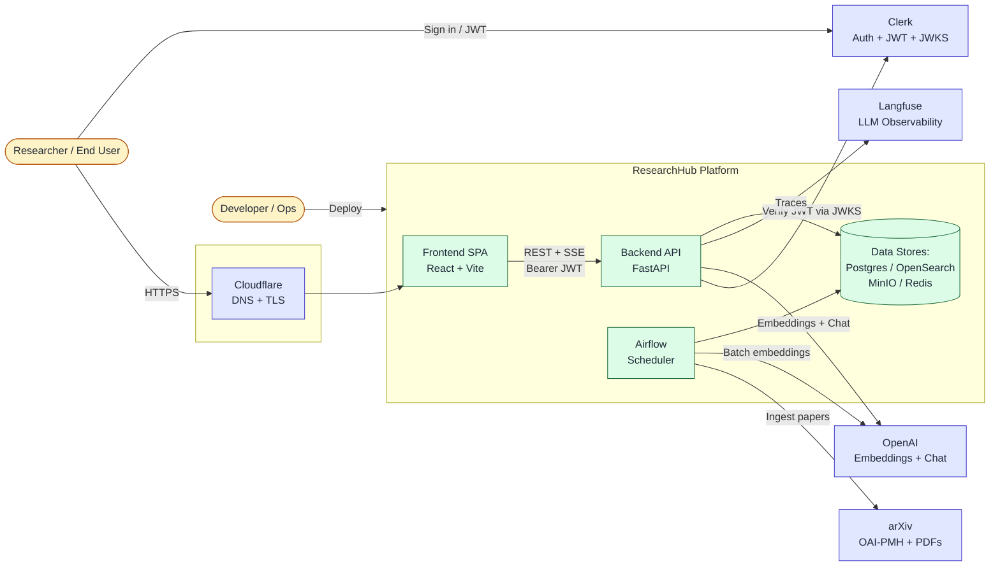

**Key takeaways:**
- Authentication is fully delegated to Clerk — ResearchHub never sees a password.
- Two distinct producers of OpenAI load: the live API (per-chat) and Airflow (bulk embedding of arXiv catalog).
- Langfuse is a pure observer — removing it breaks nothing except tracing.

---

## 2. Container / Deployment View

What actually runs inside Docker Compose, with ports and dependencies.

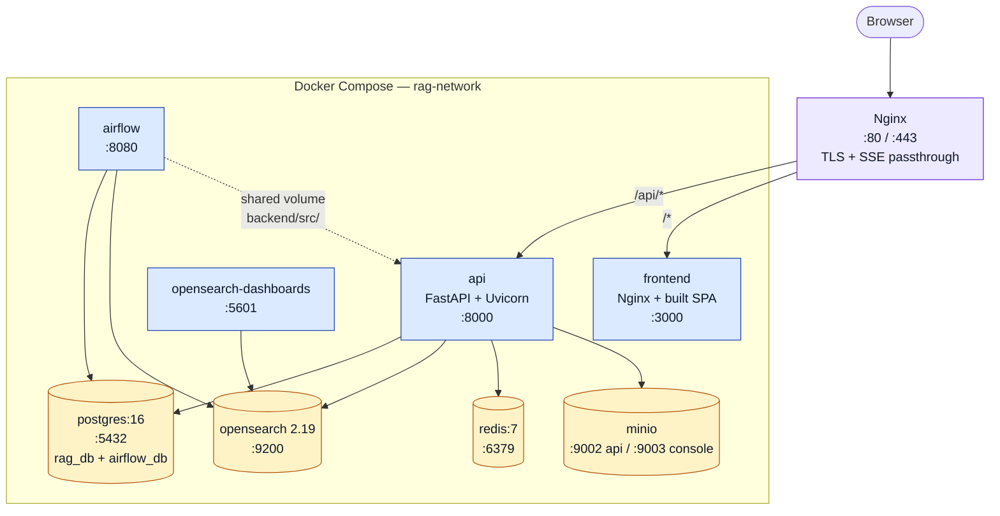

**Notes:**
- **The API container bakes source at build time** — editing `backend/src/` requires `docker compose up --build -d api`. This is documented in `CLAUDE.md` and is easy to forget.
- Airflow shares `backend/src/` by bind-mount so DAGs import the same service layer as the API.
- All volumes: `postgres_data`, `opensearch_data`, `redis_data`, `minio_data`, `airflow_logs`.

---

## 3. Backend Layered Architecture

How a request moves through the FastAPI app.

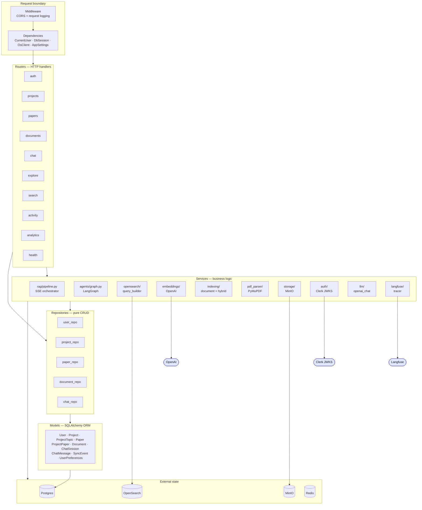

**Rules the code follows:**
- Routers **never** touch the DB directly — always via a repository or service.
- Services may call other services and repositories.
- Repositories are pure CRUD — no business rules.

---

## 4. Database Entity–Relationship Diagram

Direct mapping from `backend/src/models/`.

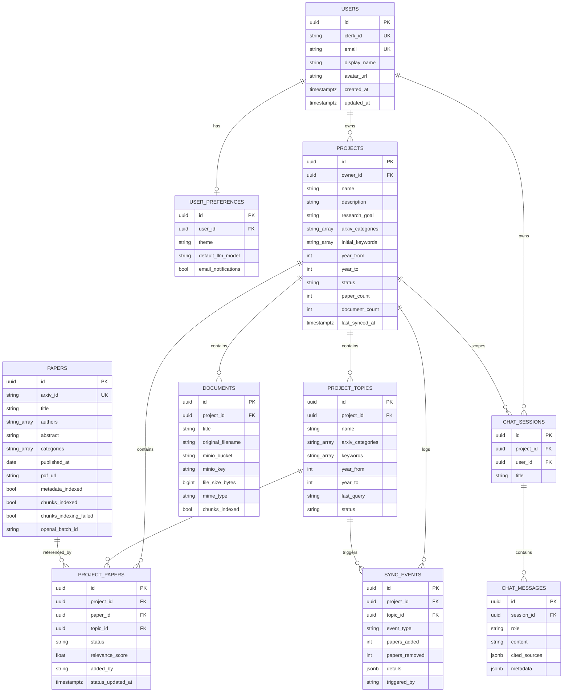

**Cascade behavior:** Deleting a `Project` cascades to topics, project_papers (join rows only — the global `papers` table is untouched), documents, chat_sessions, and sync_events.

---

## 5. Data Flow — The Big Picture

Where each kind of data lives, and how it moves between stores.

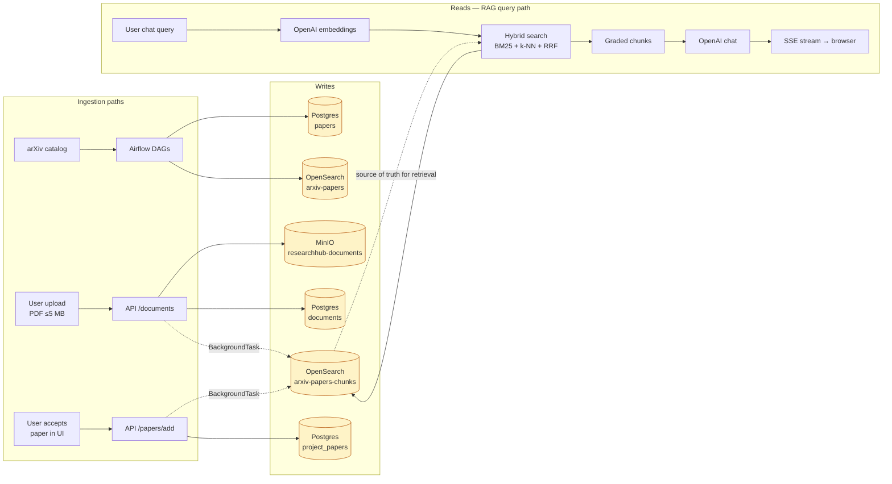

**Where each data type lives:**
| Data | Primary store | Why |
|---|---|---|
| Users, projects, topics, sessions, messages | Postgres | Relational, transactional |
| Paper metadata rows | Postgres | Referenced by `project_papers` |
| Paper abstract vectors + metadata | OpenSearch `arxiv-papers` | Discovery search |
| Paper + document chunks | OpenSearch `arxiv-papers-chunks` | RAG retrieval |
| PDF binaries | MinIO | Object storage |
| Session/auth state | Clerk (external) | Fully delegated |
| Cache | Redis | 256 MB LRU |

---

## 6. Authentication Flow

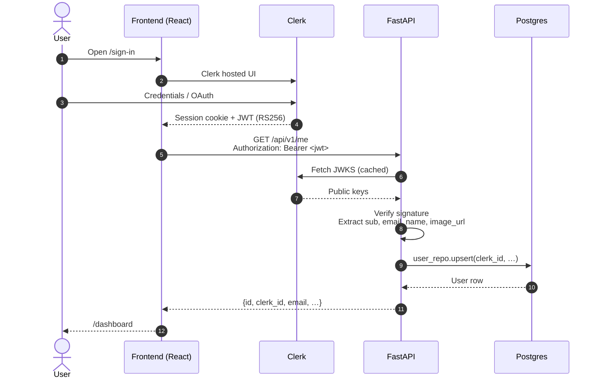

**Properties:**
- The backend **never** stores passwords.
- User row is auto-created on first verified request — there is no explicit "registration" endpoint.
- JWKS is fetched once and cached in-process; no call to Clerk per request after that.

---

## 7. RAG Chat Flow — End to End

The core product feature. This is what every other part of the system exists to support.

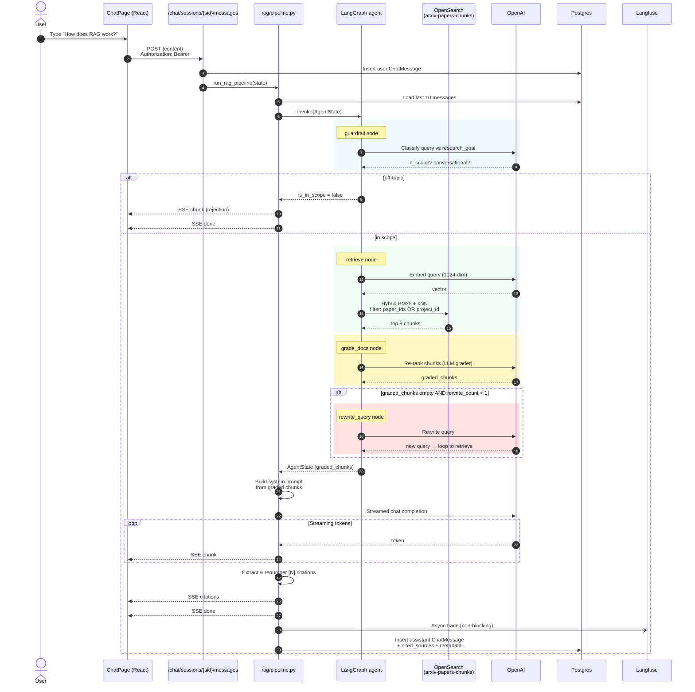

**Things worth noting on this diagram:**
- The **rewrite loop runs at most once** — if retrieval still fails, the pipeline proceeds to generation with an empty context. This is the most likely hallucination vector.
- Citation renumbering happens **after** streaming completes, so the client sees raw `[1]`, `[3]`, `[7]` markers in the text and only learns the mapping when the `citations` event arrives.
- Langfuse tracing is fire-and-forget — a Langfuse outage cannot stall a chat.

---

## 8. Document Upload & Indexing Flow

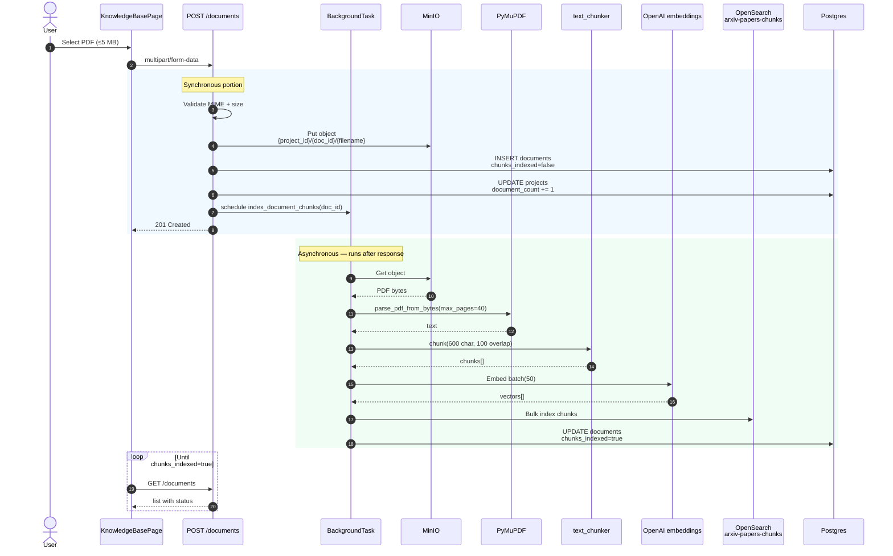

**Risk flagged in the codebase report:** the async portion is a FastAPI `BackgroundTask` — if the API container restarts mid-task, the document ends up orphaned with `chunks_indexed=false` and **nothing retries it**.

---

## 9. Paper Discovery → Accept → Index Flow

The "Living Knowledge Base" lifecycle for an arXiv paper.

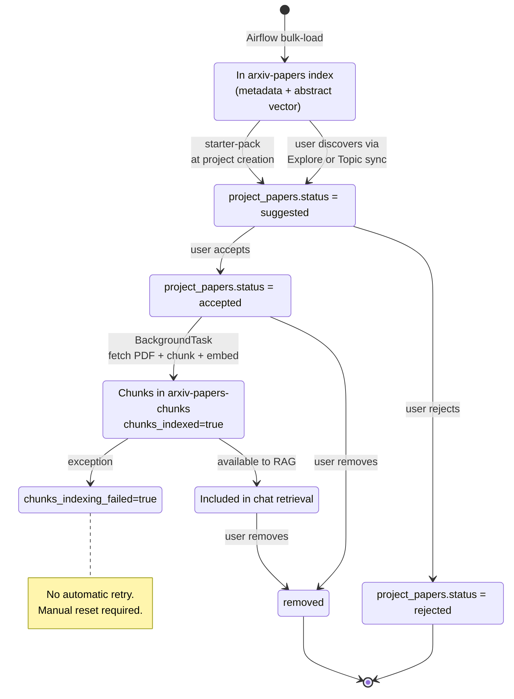

**Key state transitions in code:**
- `suggested → accepted` happens in `PATCH /papers/{paper_id}` and triggers the indexing background task.
- `indexing → retrievable` is implicit — as soon as `chunks_indexed=true`, the retrieve node will find the chunks.
- `accepted → removed` does **not** delete the global `papers` row, only the `project_papers` join row.

---

## 10. Project Creation Wizard (Frontend-Driven Flow)

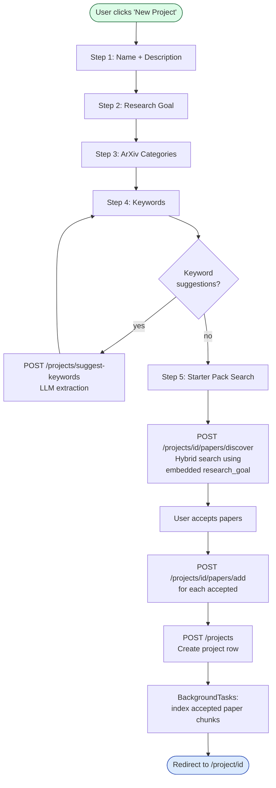

**Quirk worth knowing:** `research_goal` is embedded **once** at discovery time. If the user later edits it on the Settings page, the stored embedding is **not** refreshed — subsequent discoveries use stale semantics.

---

## 11. Airflow DAG Topology

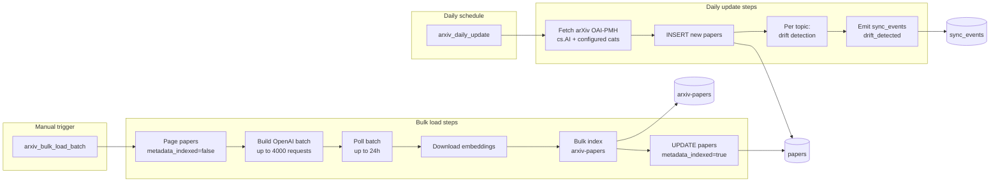

Both DAGs import `backend/src/services/*` via the shared volume mount, so they run the same embedding, indexing, and query-building code as the API.

---

## 12. Request Lifecycle Through the Backend

A single composite view — what happens from the TCP packet arriving at Nginx to the response leaving.

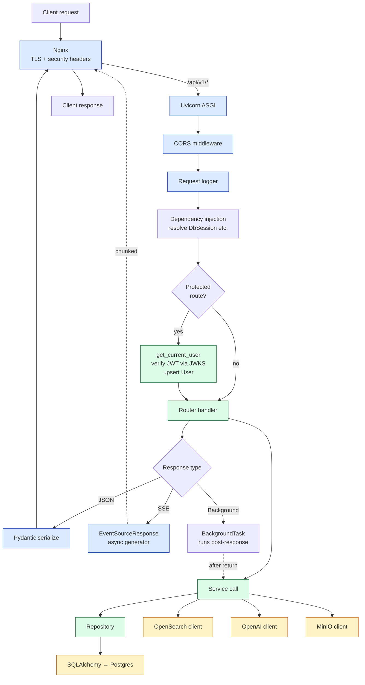

---

## 13. Known Couplings & Fragility Map

A visual version of the risks section from `CODEBASE_REPORT.md` — what breaks what.

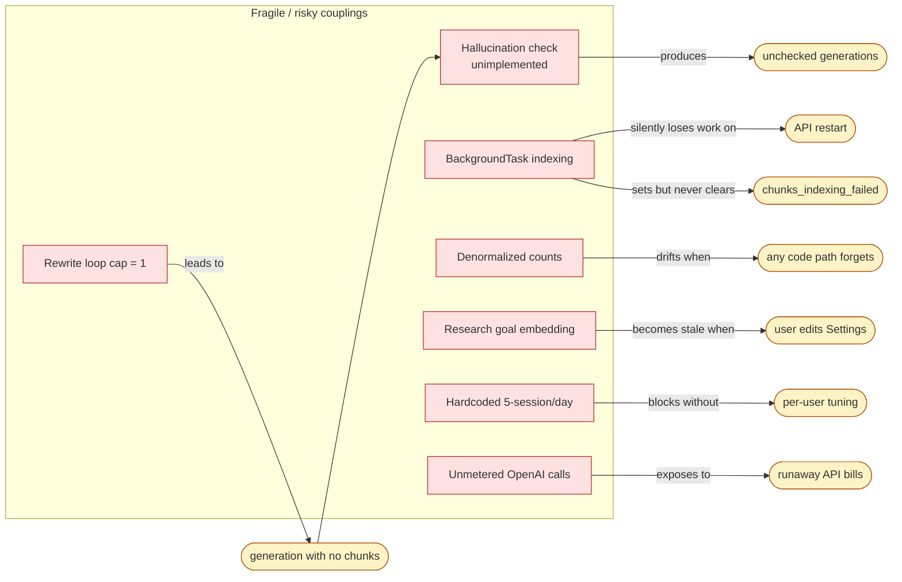

**Read this diagram as: "If you change X, you need to also think about Y."**

---

## 14. Appendix — How to View These Diagrams

- **GitHub** renders Mermaid natively when viewing `.md` files.
- **VS Code** with the *Markdown Preview Mermaid Support* extension renders them in the preview pane.
- **Obsidian / Typora / Notion** all support Mermaid.
- To export a single diagram as PNG/SVG: paste the fenced block into <https://mermaid.live>.

---

## 15. Cross-Reference

| Question | See section |
|---|---|
| "Who talks to what outside the system?" | §1 System Context |
| "What actually runs in Docker?" | §2 Container View |
| "How is the backend layered?" | §3 Backend Layers |
| "What does the DB look like?" | §4 ER Diagram |
| "Where does each piece of data live?" | §5 Data Flow |
| "How does login work?" | §6 Auth Flow |
| "What happens when I send a chat message?" | §7 RAG Flow |
| "What happens when I upload a PDF?" | §8 Document Flow |
| "What are the states of a paper in a project?" | §9 Paper Lifecycle |
| "How does project creation work?" | §10 Wizard Flow |
| "What do the scheduled jobs do?" | §11 Airflow |
| "What does every request go through?" | §12 Request Lifecycle |
| "What's brittle in this system?" | §13 Fragility Map |
