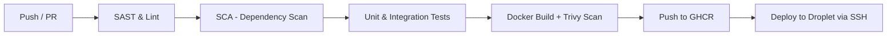

# DevSecOps Pipeline — Implementation Plan

## Overview

A zero-infrastructure, cloud-native CI/CD pipeline for ResearchHub using **GitHub Actions** as the sole orchestrator. The pipeline automates: code quality gates → security scanning → testing → container hardening → deployment to a DigitalOcean Droplet.



---

## Codebase Context

| Component | Stack | Lint/Test Tools | Dockerfile |
|-----------|-------|----------------|------------|
| Backend   | FastAPI, Python 3.12, uv | ruff, mypy, pytest | Multi-stage (`uv` builder → `python:3.12-slim`) |
| Frontend  | React 19, Vite, TypeScript | ESLint, `tsc` | Multi-stage (`node:20` builder → `nginx:alpine`) |
| Airflow   | Airflow 2.10, Python 3.12 | — | Single-stage (`python:3.12-slim`) |
| Infra     | Compose (8 services) | — | — |

> [!IMPORTANT]
> The [backend/tests/](file:///Users/youhorng/Desktop/final-year-project/researchhub-ai-rag-system-final-year-project/backend/tests) directory currently only contains a [.gitkeep](file:///Users/youhorng/Desktop/final-year-project/researchhub-ai-rag-system-final-year-project/backend/tests/.gitkeep). The pipeline will be ready for tests, but you'll need to add actual test files for the test stage to be meaningful.

---

## User Review Required

> [!WARNING]
> **GitHub Secrets** — You will need to configure these in GitHub → Settings → Secrets and variables → Actions before the pipeline works:

| Secret | Purpose |
|--------|---------|
| `DIGITALOCEAN_SSH_KEY` | Private SSH key for Droplet deployment |
| `DIGITALOCEAN_HOST` | Droplet IP address |
| `DIGITALOCEAN_USER` | SSH username (e.g. `root` or `deploy`) |
| `SNYK_TOKEN` | Free Snyk API token ([app.snyk.io](https://app.snyk.io)) |
| `SONAR_TOKEN` | SonarQube Cloud token ([sonarcloud.io](https://sonarcloud.io)) |
| `SONAR_ORG` | SonarQube Cloud organization key |
| `OPENAI_API_KEY` | For backend integration tests |
| `CLERK_SECRET_KEY` | For backend integration tests |
| `VITE_CLERK_PUBLISHABLE_KEY` | For frontend build |
| `VITE_API_URL` | API URL for frontend build (prod domain) |

> [!NOTE]
> **SonarQube Cloud & Snyk are free** for open-source / small projects. If you don't want either tool initially, the pipeline is designed so those jobs can be easily skipped (they're independent jobs, not blockers for the build).

---

## Proposed Changes

### Pipeline Workflow Files

#### [NEW] [ci.yml](file:///Users/youhorng/Desktop/final-year-project/researchhub-ai-rag-system-final-year-project/.github/workflows/ci.yml)

Main CI pipeline triggered on every push/PR to `main` and `develop`. Contains 5 jobs:

1. **`lint`** — Runs `ruff check` + `mypy` (backend) and `eslint` + `tsc` (frontend) in parallel using a matrix strategy
2. **`sca`** — Snyk dependency scan on both [pyproject.toml](file:///Users/youhorng/Desktop/final-year-project/researchhub-ai-rag-system-final-year-project/backend/pyproject.toml) and [package.json](file:///Users/youhorng/Desktop/final-year-project/researchhub-ai-rag-system-final-year-project/frontend/package.json)
3. **`test`** — Backend pytest with a real Postgres service container; Frontend build check (`tsc -b && vite build`)
4. **`build-scan-push`** — Builds Docker images for backend + frontend, scans with Trivy, pushes to GHCR
5. **`deploy`** — SSH into Droplet, pull latest images from GHCR, restart containers

Job dependency chain:
```
lint ──┐
       ├──► test ──► build-scan-push ──► deploy (main only)
sca ───┘
```

---

#### [NEW] [sonar-project.properties](file:///Users/youhorng/Desktop/final-year-project/researchhub-ai-rag-system-final-year-project/sonar-project.properties)

SonarQube Cloud configuration that tells the scanner where the source code lives and what to exclude (node_modules, .venv, data files, etc.)

---

#### [NEW] [.snyk](file:///Users/youhorng/Desktop/final-year-project/researchhub-ai-rag-system-final-year-project/.snyk)

Snyk policy file to ignore known false positives if needed.

---

#### [NEW] [.env.ci](file:///Users/youhorng/Desktop/final-year-project/researchhub-ai-rag-system-final-year-project/.env.ci)

Minimal env file for CI integration tests. Uses Postgres service container values, mock/test API keys. **No real secrets** — those come from GitHub Secrets at runtime.

---

#### [NEW] [compose.ci.yml](file:///Users/youhorng/Desktop/final-year-project/researchhub-ai-rag-system-final-year-project/compose.ci.yml)

Stripped-down Compose override for CI that only starts the services needed for integration tests (postgres, opensearch, redis) — skips airflow, minio, dashboards, frontend.

---

### Deployment Script

#### [NEW] [deploy.sh](file:///Users/youhorng/Desktop/final-year-project/researchhub-ai-rag-system-final-year-project/scripts/deploy.sh)

Deployment script that runs on the Droplet via SSH:
1. Logs in to GHCR
2. Pulls latest backend + frontend images
3. Runs `docker compose up -d` with the new images
4. Runs health checks to verify deployment
5. Rolls back on failure

---

## Pipeline Details

### Stage 1: SAST & Linting (`lint` job)

```yaml
# Backend (runs in parallel via matrix)
- uses: astral-sh/setup-uv@v5
- run: uv sync --frozen --dev
- run: uv run ruff check src/
- run: uv run ruff format --check src/
- run: uv run mypy src/

# Frontend (parallel matrix leg)
- run: npm ci
- run: npx eslint .
- run: npx tsc --noEmit
```

### Stage 2: SCA — Dependency Scanning (`sca` job)

```yaml
- uses: snyk/actions/python-3.12@master    # scans pyproject.toml
  with:
    args: --severity-threshold=high
- uses: snyk/actions/node@master            # scans package.json
  with:
    args: --severity-threshold=high
```

### Stage 3: Tests (`test` job)

```yaml
services:
  postgres:
    image: postgres:16-alpine
    env: { POSTGRES_DB: test_db, POSTGRES_USER: test, POSTGRES_PASSWORD: test }
    ports: [5432:5432]

steps:
  - run: uv run pytest --cov=src --tb=short
```

### Stage 4: Build + Trivy Scan + Push (`build-scan-push` job)

```yaml
# For each image (backend, frontend):
- uses: docker/build-push-action@v6
  with: { push: false, load: true, tags: "ghcr.io/$REPO/backend:$SHA" }

- uses: aquasecurity/trivy-action@master
  with:
    image-ref: "ghcr.io/$REPO/backend:$SHA"
    severity: CRITICAL,HIGH
    exit-code: 1                              # Fail pipeline on CRITICAL/HIGH

- uses: docker/build-push-action@v6           # Push only if Trivy passes
  with: { push: true }
```

### Stage 5: Deploy (`deploy` job, main branch only)

```yaml
- uses: appleboy/ssh-action@v1
  with:
    host: ${{ secrets.DIGITALOCEAN_HOST }}
    username: ${{ secrets.DIGITALOCEAN_USER }}
    key: ${{ secrets.DIGITALOCEAN_SSH_KEY }}
    script: bash /opt/researchhub/scripts/deploy.sh
```

---

## Files Summary

| File | Type | Purpose |
|------|------|---------|
| `.github/workflows/ci.yml` | NEW | Main CI/CD pipeline (5 jobs) |
| `sonar-project.properties` | NEW | SonarQube Cloud config |
| `.snyk` | NEW | Snyk policy (empty, placeholder) |
| `.env.ci` | NEW | CI-only env vars (no secrets) |
| `compose.ci.yml` | NEW | Slim Compose for CI tests |
| `scripts/deploy.sh` | NEW | Droplet deploy + rollback script |

---

## Verification Plan

### Automated
- Push to a feature branch → confirm all 5 workflow jobs appear in GitHub Actions tab
- Verify lint job catches a deliberate ruff violation
- Verify Trivy scan catches a known-vulnerable base image (test with an old `python:3.8` temporarily)

### Manual
- After first successful deploy, SSH into Droplet and run `docker ps` + `curl health endpoints`
- Verify GHCR images appear at `ghcr.io/<your-org>/researchhub-*`
